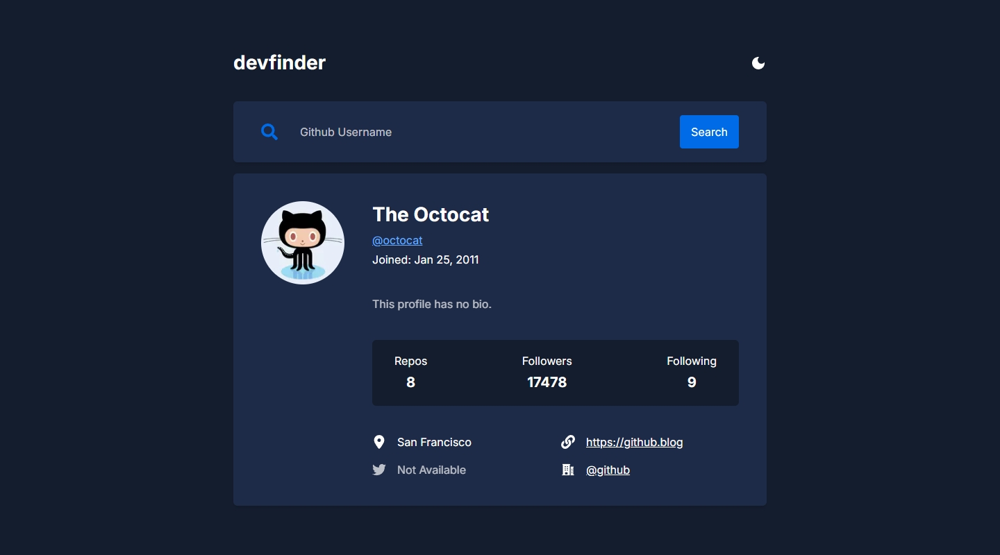
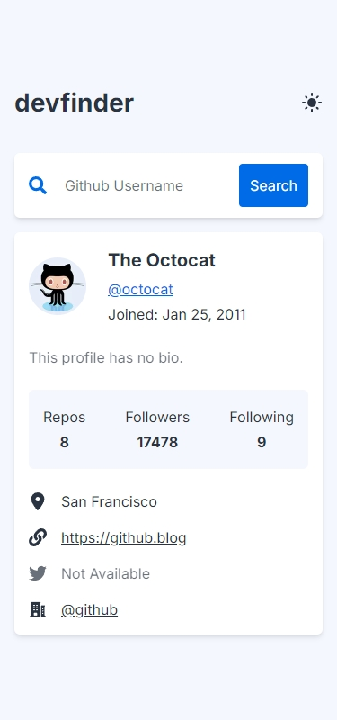

## Frontend Mentor Challenge 29 - Github User Search App

This is my solution to the [Github User Search App](https://www.frontendmentor.io/challenges/github-user-search-app-Q09YOgaH6) challenge on [Frontend Mentor](https://www.frontendmentor.io/).

#

### Links 🔗

- Live Site URL: https://devfinder-darkstarxdd.vercel.app/

#

### Built with 🔨

- Next.js
- TypeScript
- Tailwind
- Zod

#

### Features ✨

- The URL search params get updated when a username is searched, which gives couple of advantages:
  - Each search is stored in browser history (supports back/forward navigation).
  - Pages can be bookmarked or shared with the searched username.
  - No need for client-side state to track the search.
- Error message shown for non-existing usernames.
- Light/dark theme toggle with [next-themes](https://www.npmjs.com/package/next-themes).

#

### Technical Details 🔧

- When a user searches for a username and presses Enter, the search parameters in the URL update with the entered username using `router.push()`.
- This triggers a re-render of `page.tsx` (a server component), which sends a new fetch request to the GitHub API using the username from the search parameters.
- Once the user data is retrieved, the child components re-render with the newly fetched data.
- Used Zod to validate the response received from the API.
- Updated the web page title with the searched username using Next's `generateMetadata` function.
- Most components are server components.

#

### Screenshots of the Solution (Desktop & Mobile) 🔍

#

- Some tools i use - [DarkstarXDD/tools](https://gist.github.com/DarkstarXDD/4b1844eda12f34b667a0c36e05fcbdf9)
- My Frontend Mentor profile - [@DarkstarXDD](https://www.frontendmentor.io/profile/DarkstarXDD)
